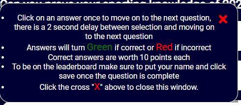

<h1 align="center">Sport Quiz 2021 </h1>

## Introduction
This interactive quiz is based on the sporting achievements of the past year to show there were some great sporting moments of 2021 as a part of my project portfolio to demonstrate the skills I have developed from the JavaScript Essentials module.

View the live website on GitHub [Sports Quiz 2021](https://ryanmawalker.github.io/sports-quiz-portfolio-2/)

<h1 align="center">User Experience (UX)</h1>

-   ### User Stories

    -   #### First Time Visitor Goals

        * Understand the main purpose of this site.
        * Play anytime.
        * Easily understand how to play.
        * See my score.
        * See when I get an answer right.
        

    -   #### Returning Visitor Goals 

        * Beat other scores.
        * Better my own score.
        * Repeat the quiz again.

    -   #### Author Goals

        * Provide an modern clean webpage.
        * Provide a record of scores.
        * I want the user to see if their answer was correct/incorrect.
        * I want to create an interactive experience.
        * I want the user to be able to quit at anytime.
        * I want to ensure a good user experience on mobile. 

### Opportunities/Problems

|Opportunities | Importance | Viability / Feasibility
|-----|:------:|:-----:|
|**Entice the user using interactive design** | 5 | 5 |
|**Responsive site for mobile and tablet** | 5 | 5 |
|**Provide niche sporting information** | 5 | 5 |
|**Provide a competitive experience** | 4 | 3 |

### Wireframe mockups
To produce a basic mockup of the site layouts I used Balsamiq. 

* [Home page wireframe](assests/images/design/wireframesHomepage.png)
* [Quiz page wireframe](assests/images/design/wireframesQuiz.png)
* [Submission page wireframe](assests/images/design/wireframesSubmit.png)
* [Highscores page wireframe](assests/images/design/wireframesHighscores.png)

### Design

Following the overall structure of the wireframes being established, I first researched other sports quiz websites to find what the current most popular sites are. In this case the most popular were all sections of news websites e.g. [The Guardian](https://www.theguardian.com/sport/series/sports-quiz-of-the-week), [The Independent](https://www.independent.co.uk/sport/gerwyn-price-tom-brady-anthony-joshua-australian-open-super-bowl-lv-b1977108.html) and [BBC Sport](https://www.bbc.co.uk/sport/59731273).

From the above research I decided to take inspiration from popular free quiz apps such as "General Knowledge Quiz" by Trivia and "General Knowledge Trivia Quiz" by GK questions and answers game. Both of which have a simple and clear User Interface for the questions. 

### Color Scheme

The color scheme design focus was based around the image I decided upon from the following shortlist from shutterstock:
* [Blue and White](assests/images/blue-white.webp)
* [Yellow and Dark Green](assests/images/yellow-blue.webp)
* [Multi-Color Sports](assests/images/multiColorSports.jpg)

I decided upon the Blue and White image, as it is reminiscent of the current social media football style of paint strokes with players over the top. 

I decided to color match the dark blue of the image using [imagecolorpicker.com](https://imagecolorpicker.com/) 

The main text color used was white as this had one of the best constrasts when tested with [WebAIM](https://webaim.org/resources/contrastchecker/)

For the hover over effects I invert the colors to clearly shows the user the option selected.

Standard Green and Red colors were used to show when a question was correct or incorrect respectively.

Green was used as the progress bar as it gave a hugh contrast to the rest of the colors across the website.

### Typography

The font used for all bodies of text was Roboto to carry a consistent visual and was imported from google fonts. 

<h1 align="center">Features</h1>

## Continuous Features

* ### Content Container

    - This gives a clear section for the content to be clearly viewed.
    - This gives a consistent design across the site providing the "clean" asthetic specified in my design brief.

    

    - Above is the content container for desktop displaying the homepage. 

    

    - Above is the content container for desktop displaying the quiz page. 

* ### Footer

    - Includes copyright statement on each page using [Font Awesome](https://fontawesome.com/v5.15/icons/copyright?style=regular)

        

* ### Buttons

    * Two button style types are used, the difference being the hover action depending on the current page. 
    * Homepage, Submission, Highscore all have the same styling and hover over action which inverts the color. This provides a visual break when the quiz page is active representing a difference for the game section of the website.
    * All buttons when hovered change the mouse cusor to a pointer showing the user it's interactive.0

        

## Homepage 

   * First page the user interacts with as such it contains all navigation features.
   * Gives quick access to quiz, highscores and rules
   * Rules are provided as part of a modal popup window as loading the rules on a seperate page would take from the user experience.

   
   

## Quiz 

The user is directed to this page via the homepage each question is randomly generated from a set list of questions. The functionality of the quiz page is listed below.

###  Game Information area

* Provides the user their score and current question number.
* This dynamically updates as the user completes a question up to the maximum number of questions.
* The score increases by 10 for each answer given correctly, incorrect answers provide no additional score. 
    
     

### Question & Answer section

* Question shown at the top in a larger font to all other objects in the area to distiguish it.
* Questions are randomly generated.
* Each time a question is pulled the user is given 4 answers.
* Hovered over answers increase in size to showing the user where their selection is. 

* Correctly selected answers turn green and incorrectly answers change red.
 

### Progress Bar 

* Updates as the user completes the quiz
* Purpose of using green is the color stands out giving the user a visual progression and a positive association as a correct answer also changes green encouraging the user to complete the quiz.  

### Quit Game Option

* Returns the user and clears the local storage of that attempt so the highscore doesn't register the attempt the user quit.

## Submission Page

Upon completion of the quiz the user is directed to the submission page which displays the user score and contains the following features:

* Name input to be saved to the highscores, to save a score there must be an input in the enter name section.
* Name input can be complete either by clicking the save option or pressing the enter key
* Option to attempt the quiz again.
* Option to return to the home page.
* The score updates to the users total score from the current attempt. 

## High

