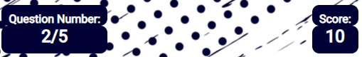

<h1 align="center">Sport Quiz 2021 </h1>

## Introduction
This interactive quiz is based on the sporting achievements of the past year to show there were some great sporting moments of 2021 as a part of my project portfolio to demonstrate the skills I have developed from the JavaScript Essentials module.

View the live website on GitHub [Sports Quiz 2021](https://ryanmawalker.github.io/sports-quiz-portfolio-2/)

<h1 align="center">User Experience (UX)</h1>

-   ### User Stories

    -   #### First Time Visitor Goals

        * Understand the main purpose of this site.
        * Play anytime.
        * Easily understand how to play.
        * See my score.
        * See when I get an answer right.
        

    -   #### Returning Visitor Goals 

        * Beat other scores.
        * Better my own score.
        * Repeat the quiz again.

    -   #### Author Goals

        * Provide an modern clean webpage.
        * Provide a record of scores.
        * I want the user to see if their answer was correct/incorrect.
        * I want to create an interactive experience.
        * I want the user to be able to quit at anytime.
        * I want to ensure a good user experience on mobile. 

### Opportunities/Problems

|Opportunities | Importance | Viability / Feasibility
|-----|:------:|:-----:|
|**Entice the user using interactive design** | 5 | 5 |
|**Responsive site for mobile and tablet** | 5 | 5 |
|**Provide niche sporting information** | 5 | 5 |
|**Provide a competitive experience** | 4 | 3 |

## Wireframe mockups
To produce a basic mockup of the site layouts I used Balsamiq. 

* [Home page wireframe](assests/images/design/wireframesHomepage.png)
* [Quiz page wireframe](assests/images/design/wireframesQuiz.png)
* [Submission page wireframe](assests/images/design/wireframesSubmit.png)
* [Highscores page wireframe](assests/images/design/wireframesHighscores.png)

## Design

Following the overall structure of the wireframes being established, I first researched other sports quiz websites to find what the current most popular sites are. In this case the most popular were all sections of news websites e.g. [The Guardian](https://www.theguardian.com/sport/series/sports-quiz-of-the-week), [The Independent](https://www.independent.co.uk/sport/gerwyn-price-tom-brady-anthony-joshua-australian-open-super-bowl-lv-b1977108.html) and [BBC Sport](https://www.bbc.co.uk/sport/59731273).

From the above research I decided to take inspiration from popular free quiz apps such as "General Knowledge Quiz" by Trivia and "General Knowledge Trivia Quiz" by GK questions and answers game. Both of which have a simple and clear User Interface for the questions. 

## Color Scheme

The color scheme design focus was based around the image I decided upon from the following shortlist from shutterstock:
* [Blue and White](assests/images/blue-white.webp)
* [Yellow and Dark Green](assests/images/yellow-blue.webp)
* [Multi-Color Sports](assests/images/multiColorSports.jpg)

I decided upon the Blue and White image, as it is reminiscent of the current social media football style of paint strokes with players over the top. 

I decided to color match the dark blue of the image using [imagecolorpicker.com](https://imagecolorpicker.com/) 

The main text color used was white as this had one of the best constrasts when tested with [WebAIM](https://webaim.org/resources/contrastchecker/)

For the hover over effects I invert the colors to clearly shows the user the option selected.

Standard Green and Red colors were used to show when a question was correct or incorrect respectively.

Green was used as the progress bar as it gave a hugh contrast to the rest of the colors across the website.

## Typography

The font used for all bodies of text was Roboto to carry a consistent visual and was imported from google fonts. 

<h1 align="center">Features</h1>

## Continuous Features

* ### Content Container

    - This gives a clear section for the content to be clearly viewed.
    - This gives a consistent design across the site providing the "clean" asthetic specified in my design brief.

    

    - Above is the content container for desktop displaying the homepage. 

    

    - Above is the content container for desktop displaying the quiz page. 

* ### Footer

    - Includes copyright statement on each page using [Font Awesome](https://fontawesome.com/v5.15/icons/copyright?style=regular)

        

* ### Buttons

    * Two button style types are used, the difference being the hover action depending on the current page. 
    * Homepage, Submission, Highscore all have the same styling and hover over action which inverts the color. This provides a visual break when the quiz page is active representing a difference for the game section of the website.
    * All buttons when hovered change the mouse cusor to a pointer showing the user it's interactive.0

        

## Homepage 

   * First page the user interacts with as such it contains all navigation features.
   * Gives quick access to quiz, highscores and rules
   * Rules are provided as part of a modal popup window as loading the rules on a seperate page would take from the user experience.

   
   

## Quiz 

The user is directed to this page via the homepage each question is randomly generated from a set list of questions. The functionality of the quiz page is listed below.

###  Game Information area

* Provides the user their score and current question number.
* This dynamically updates as the user completes a question up to the maximum number of questions.
* The score increases by 10 for each answer given correctly, incorrect answers provide no additional score. 
    
     

### Question & Answer section

* Question shown at the top in a larger font to all other objects in the area to distiguish it.
* Questions are randomly generated.
* Each time a question is pulled the user is given 4 answers.
* Hovered over answers increase in size to showing the user where their selection is. 

* Correctly selected answers turn green and incorrectly answers change red.
 

### Progress Bar 

* Updates as the user completes the quiz
* Purpose of using green is the color stands out giving the user a visual progression and a positive association as a correct answer also changes green encouraging the user to complete the quiz.  

### Quit Game Option

* Returns the user and clears the local storage of that attempt so the highscore doesn't register the attempt the user quit.

## Submission Page

Upon completion of the quiz the user is directed to the submission page which displays the user score and contains the following features:

* Name input to be saved to the highscores, to save a score there must be an input in the enter name section.
* Name input can be complete either by clicking the save option or pressing the enter key
* Option to attempt the quiz again.
* Option to return to the home page.
* The score updates to the users total score from the current attempt. 

## High Scores Page

The user submits their name and is directed to this page. 

* The current max users that will register on the highscores is 5.
* Listen in order of score then in order of submission timing e.g. in the image below Ryan is Above bethan as Ryan submitted thier score before Bethan. 
* If another person scores higher than the user at the bottom then the user at the bottom is removed from the score list and the higher scoring new user takes their place. 

<h1 align="center">Mobile Compatibility</h1>

As noted in the design section a prority of this project is to ensure a good user experience on mobile devices. The use of flex box containers ensures a dynamic interface regardless of screen size. Media queries are added to do the following:

* Adjust the vertical position of each page
* Extend the content containers to full page width at 700px this was the tested cut off point using google chrome developer tools where the user's experience was worsened without media querying. 
* Reduce font size
* Reduce button size
* Center the rules modal

<h1 align="center">Future Improvements</h1>

Compared to other online sports quizzes this project can be improved, there are additional features I would like to add as well however I'm not able to implement due to time constraints and it being my early attempts with JavaScript: 

* Answer images - All sporting achievements are done as an individual or a team of people as such images could be used in conjunction with the athelete/team's name as an interactive option. 
* User feedback form - This is something that I forgot to include in my mockups and subsequently only when writing out this list of future improvements I have now noticed it has been forgotten.
* User question creation - An option for the user to submit their own questions however it would then bring about the problem of curation. 
* Empty section of the progress bar - Currently the progress bar is all or nothing there's no empty section to represent how much further there is of the quiz. I had attempted this during the project however the interation between the two elements resulted in a stagger effect I was unable to fix.
* Timer - An automated timer for each question which would discourage the googling of answers
* Character limit to name submission - Currently there is no limit so in theory users could hold a key to infinty and that would be submitted and shown on the highscores.
* Prevention of dev tools manipulation - Prevent users from changing the highscores in the chrome dev tools, I currently don't have the knowledge on how to do that and would look to add this in the near future once aquired.

<h1 align="center">Bugs / Development Issues</h1>

A lot of issues I had with JavaScript came down to misspelling of reference IDs or not linking to the correct id. Another reoccuring issue was incorrectly linking file paths examples and evidence of the issues are shown below:

## JavaScript Issues

* Initial understanding of the function I was writing were executing what I expected, for this I asked for both help from the code institute community on slack and to verbally go through/ discuss my friends on discord the people of which can be found in my mentions section.
    - [link to slack screenshot](assests/images/slack.jpg)
    - [link to discord messages](assests/images/discord.jpg)
* By using the liveserver extension for gitpod I was able to react quickly to issues such as reference errors the error below took a signficant amount of time to learn that I had mispelled a reference

    

* One major issue I had was that the highscores weren't updating so to over come this I console logged each step to find no fault and the application was doing what was expected, the error again came from that I used the incorrect reference ID in the button that was calling it the process of determining this error can be found below: 
    - [typenull issue](assests/images/bugs/typeNullHighScores.png)
    - [step 1](assests/images/bugs/log1.png)
    - [step 2](assests/images/bugs/log2.png)
    - [step 3](assests/images/bugs/log3.png)
    - [step 4](assests/images/bugs/log4.png)
    - [step 5](assests/images/bugs/log5.png)
    - [step 6](assests/images/bugs/log6.png)
    - [step 7](assests/images/bugs/log7.png)
    - [step 8](assests/images/bugs/log8.png)
    - [step 9](assests/images/bugs/log9.png)
    - [step 10](assests/images/bugs/log10.png)
    - [step 11](assests/images/bugs/log11.png)
    - [step 12](assests/images/bugs/log12.png)

## Developer Caused Issues

* During this project I learnt the hard way about ensuring regular git pushes. As I lost 5 days of development time by forgetting to push my code and closing everything. I attempted to force push all to regain my lost work however it was unsuccesful and I determined that going forward it was better to re-write everything with a fresh repository as it also allowed myself to pick up on any additional errors I missed first time around or improve upon what I now consider to be a "first draft"

<h1 align="center">Testing</h1>

For the testing I carried out html, CSS, JS validation tests before and after deployment. I also shared the quiz in facebook chats I'm apart of to get feedback on what users enjoyed or didn't. This also allowed me to have multiple devices test this with varying users so bugs would be prominent.

## Devices Tested On

* Macbook Pro
* iPhone XR
* iPhone XS
* iPhone 12
* Google Pixel 5
* Windows PC 1920 * 1080

## Feedback

* Permission has been given to share the group chat messages of user feedback.
* [First some of the pages came back with errors](assests/images/feedback/publicTest1.png) this was fixed by changing the filepaths.
* [Second position of the close icon for rules](assests/images/feedback/feedBack1.png).
* [Third on mobile the previous option stays enlarged](/workspace/sports-quiz-portfolio-2/assests/images/feedback/feedback2-bug.png) this has yet to be fixed and is in the future development section. 

## Validation Results

### Predeployment

#### HTML 
* [The only warning accross all pages was the repeat use the the ID "red" which was subsequently changed to a class](assests/images/testing/preDployHTML.png)
#### CSS
* Reoccurring warning that I have chosen to ignore as the issue is regarding the [blue color used](assests/images/testing/preDployCSS2.png) I didn't notice when using the color picker tool that it had produce 4 parameters for the rgba code, however because this had been working I didn't realise until validation. The color works so I've foregone changing it.
#### JS
* Inital [error](assests/images/testing/preDeployJS1.png) was in relation to ES6 to overcome this all my JavaScript has the following line added "/* jshint esversion6 */" which makes the validator recognise es6 functionality such as template literals. 
* Constant warning of [missing semi-colons](assests/images/testing/preDeployJS2.png) fixed and will be shown the in deployment section.

### Deployment 
#### HTML 
* [link to Index page test result](https://validator.w3.org/nu/?doc=https%3A%2F%2Fryanmawalker.github.io%2Fsports-quiz-portfolio-2%2Findex.html)

